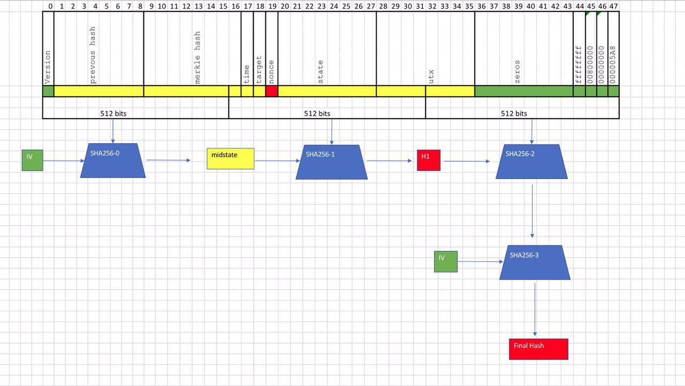

I asked johninaustin (telegram) how we made a GPU miner for HTMLCOIN. This is his outline of the steps that got him getting interested in HTMLCOIN to building a GPU miner for it.

~~~

Here’s a basic outline of how i went from knowing nothing about htmlcoin, blockchain, mining, etc to building a working gpu miner for htmlcoin.

1) get interested in HTMLCOIN through a friend

2) bought some (~$1k worth)

3) started CPU mining 1/3 w/ an old mac pro.  wondered about GPU mining.  

4) started researching on 2/2 - need to learn about blockchain - https://github.com/bitcoinbook/bitcoinbook

5) understood general idea - took a block header from bitcoin & computed sha256d w/ python sha libs to physically see the hash & how it works.

6) need to understand sha256 - http://www.iwar.org.uk/comsec/resources/cipher/sha256-384-512.pdf  Studied this - it’s pretty simple. Just bit shifting, simple logic / addition, etc.  

7) wrote a simple c program to compute sha256 - used examples in PDF until it worked properly.

8) need to understand what’s being hashed for htmlcoin / how is it different from htmlcoin? added debugging info to dump memory before hash is computed.  w/ hex dump, found the correct bytes for a block.  compared those to the block header to identify the fields.  found that it’s basically the bitcoin header + 2 fields, then 0’s, F’s, and 2 more 0’s.  (1448 bits vs 640 bits)

9) took a block from the htmlcoin blockchain, took the fields, computed sha256 using my simple program (twice, for 256d).  got a match.  now i know what’s being hashed and know how to hash it

10) need to learn OpenCL basics - http://www.drdobbs.com/parallel/a-gentle-introduction-to-opencl/231002854?pgno=3  
and https://www.nersc.gov/assets/pubs_presos/MattsonTutorialSC14.pdf

11) wrote a very crude sha256d implementation for OpenCL.  pass the info, compute hash for all 2^32 nonce values.  it returned successfully in under 20 seconds on a 5 year old mac!   looked at resulting nonce, after byte swapping, it matched!  This is 2^32 hashes - 4x the “999999999” getwork command that took 24+ minutes to complete.  So I’m doing 100+ minutes of CPU work in 20 seconds on an old Mac GPU with unoptimized code…

12) so now i know what’s being hashed, how to hash it, and i know OpenCL can do it. now i have to communicate info from htmlcoin blockchain to the hash engine - implement getwork. studied getwork on bitcoin website. it’s a simple protocol.

13) update getwork using the htmlcoin getwork branch.  updated headers, padding, length (computed padding incorrectly, but that’s okay - miner only looks at the required fields. i meant to clean it up “later”).  i had a segfault here for a couple of days - smart pointers cleaning up because i wasn’t saving references… i fixed all this quickly enough.  I made sure i was paying the right address (i noticed one of the other guys who solved ~ the 15th failed to do that - solved a block w/ no payment. :) )

I haven’t done c/c++ in 15+ years - i took longer than a normal c/c++ programmer would have taken.  

14) find a miner w/ getwork support.  i chose bfgminer since i was doing OpenCL.  

15) used nwoolls brew to install all prerequisites.  then downloaded code & started modifications - https://nwoolls.github.io/homebrew-xgminer/

16) was debugging, running code, and i didn’t even notice my first mined block!  i’d been changing code / debugging, so i wasn’t sure if i “broke” something… let that run.  it wasn’t too stable (htmlcoin had some segfaults, and when blocks were cleared out server side, the client would endlessly resend, leading to failures [returning error instead of false]).  fixed all that quickly.  first mined block was 2/8 & things ran nice & stable after this.

17) bought a 1080ti.  I compiled bfgminer for linux which had nvidia.  1080ti did only 200Mh/s :(  My 5 year old mac was doing 380Mh/s w/ OpenCL… hmm. i let it run while i worked on another solution.

18) decided i needed cuda for nvidia.  http://www.nvidia.com/docs/IO/116711/sc11-cuda-c-basics.pdf and also downloaded samples

19) wrote cuda implementation for sha256d from scratch.  tested with a block - it took almost 40 seconds.  my solution was NOT optimal.  cuda missing some of the things OpenCL had… but I didn’t know enough.  

20) started looking for cuda miners - found ccminer https://github.com/tpruvot/ccminer/releases

21) took that code & looked at the cuda implementation, which was more optimized - tweaked it to work with htmlcoin. this was done in one evening

22) tested this - now getting 830Mh/s.  I’d removed all shortcut optimizations, so there was room for improvement, but it was running, and i got 200 bocks (combined mac + 1080ti) in a single day.

Didn’t modify it much after this - things were stable, lots of blocks being mined.  I mean, I had no competition.

Code was really sloppy, and wasn’t even checked into any repository.  (i never used git, forking was new to me, etc).  Lots of room for improvement, but any minute not spending mining was a wasted minute.  So I didn’t mess w/ it.

For timing:  started 2/2, had it working 2/8 w/ amd.  had it working 2/14 with nvidia (was quick to implement, i just had other things i was doing & couldn’t devote time - but that basically only took a day). I have a day job, so this was only nights/weekends that i wasn’t already busy

Mined up till about 2/23 when someone else monetized & released a solution.  at that point, mghtthr claimed the bounty (congrats!). i released my code that same day after awkwardly forking & diffing tediously… i should have started from a fork, should have made the code much cleaner, etc.  i was (still am) a git newbie too.

Lots of folks are GPU mining now.  I’m only mining 1 block / day.  

Still, it was a fun experience… I learned a ton.